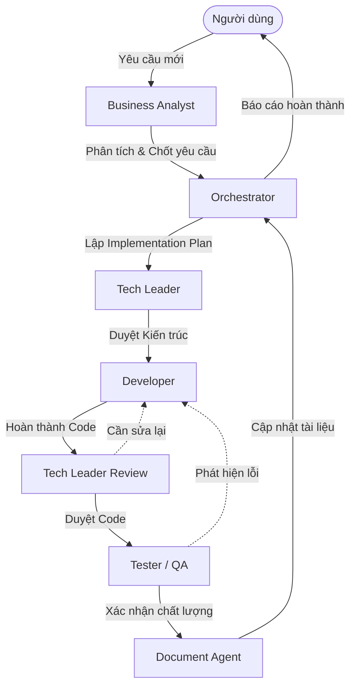

# README: Antigravity Auto-Retry

## 1. Bài Toán & Giải Pháp
**Bài toán:** Antigravity (dựa trên nền tảng Electron) thường xuyên báo lỗi "High Traffic" / "Server is busy", bắt buộc người dùng phải dùng chuột click "Retry" thủ công liên tục gây ức chế. Yêu cầu là cần tự động hóa thao tác này.

**Giải pháp đã loại bỏ:**
- *AppleScript / macOS Accessibility:* Ứng dụng Electron không expose các thành phần giao diện web (DOM) cho OS, hoàn toàn "mù" với macOS Accessibility, không thể nhận diện được nút "Retry".
- *Screen Capture + OCR:* Tốn CPU/RAM, độ chính xác không cao, dễ click trượt nếu người dùng resize cửa sổ, cuộn trang hoặc đổi theme giao diện. Quá overkill.

**Giải pháp áp dụng (CDP - Chrome DevTools Protocol):**
- **Cơ chế:** Antigravity luôn mở port debug ngầm (`31905`). Hệ thống chạy một daemon kết nối vào WebSocket này và đẩy trực tiếp (inject) mã JavaScript vào trang.
- **Hiệu quả:**
  - Dùng `MutationObserver` nhận biết 100% khi hộp thoại xuất hiện.
  - `button.click()` chuẩn xác 100%, không phụ thuộc tọa độ.
  - Rất nhẹ, tốn gần như 0% CPU.
  - Anti False-Positive: Có giới hạn scope (chỉ quét trong `.monaco-dialog-box`, `.notification-toast`), verify text (`/high traffic/`), kiểm tra nút chính xác (`/^retry$/i`) và kiểm tra mức độ hiển thị của nút để tránh click nhầm.

## 2. Cấu Trúc Dự Án
```text
antigravity-auto-click/
├── .agents/                 # Cấu hình AI Agents
│   ├── agents/              # Hướng dẫn từng role
│   ├── context/             # Bối cảnh và scope chung
│   ├── rules/               # Luật code bắt buộc
│   └── skills/              # Kỹ năng cho Agent
├── scripts/                 # Script quản lý daemon trên macOS
│   ├── menu.sh              # Giao diện menu tương tác (Khuyên dùng)
│   ├── install.sh           # Đăng ký chạy nền
│   ├── start.sh             # Kích hoạt thủ công
│   ├── stop.sh              # Dừng daemon
│   ├── trigger-test.js      # Công cụ giả lập lỗi để kiểm tra (Test)
│   └── uninstall.sh         # Gỡ cài đặt
├── src/                     # Mã nguồn chính
│   ├── auto-retry.js        # Node.js Daemon chạy ngầm
│   ├── discovery.js         # Logic tìm cổng WebSocket
│   └── injection-payload.js # Script tiêm vào Antigravity
├── IMPLEMENTATION_PLAN.md   # Thiết kế hệ thống
├── README.md                # Tài liệu dự án (File này)
└── tutorial.md              # Hướng dẫn sử dụng cho end-user
```

> **Lưu ý:** Xem hướng dẫn cài đặt và sử dụng dành cho End-User tại file [tutorial.md](./tutorial.md).

## 3. Hướng Dẫn Phát Triển (Dành Cho Developer / Người Chạy Dự Án)
**Yêu cầu môi trường:** macOS và cài đặt sẵn Node.js.
1. Cài đặt các thư viện phụ thuộc (nếu có): `npm install`
2. **Khởi chạy thủ công lúc dev:** 
   Bạn có thể chạy daemon bằng lệnh: `npm start` hoặc chạy trực tiếp bằng lệnh `node src/auto-retry.js`
3. **Theo dõi Log:**
   Khi ứng dụng đã cài thông qua `install.sh` (chạy qua LaunchAgent), toàn bộ lỗi và hoạt động sẽ ghi ở: `~/Library/Logs/AntigravityAutoRetry/` (hoặc đường dẫn log quy định trong file plist). Bạn có thể dùng `tail -f` để đọc.
4. **Phát triển Injection Payload (`src/injection-payload.js`):**
   - Chỉ được code bằng ES6+ Vanilla JavaScript. Không dùng React hay thư viện ngoài.
   - Tuyệt đối giữ cơ chế rate-limiting (cooldown 2 phút nếu quá số lần) để không spam API gây lỗi 429 hoặc sập dịch vụ.
   - Nếu thay đổi selector giao diện, cần luôn test lại xem cơ chế Zone Scoping và Text Verification có chạy chính xác không để tránh "false-positives" (Click bậy vào code của người dùng).

## 4. Hệ Thống AI Agents
Dự án được xây dựng và duy trì thông qua một đội ngũ AI Agents có vai trò chuyên biệt, phối hợp nhịp nhàng theo một quy trình cụ thể:

### Quy trình làm việc (Agent Workflow)


### Chi tiết các Agent
- **Business Analyst (BA):** Làm rõ yêu cầu từ người dùng, thiết lập tài liệu và quy trình nghiệp vụ. Đảm bảo mọi tính năng được phát triển đều giải quyết đúng vấn đề (pain points) mà không làm phình to dự án.
- **Orchestrator:** Đóng vai trò là người quản lý dự án. Phân tích bối cảnh dự án, lập kế hoạch thực thi, điều phối công việc cho các agent chuyên môn khác và tổng hợp kết quả để báo cáo lại cho người dùng.
- **Tech Leader:** Thiết kế kiến trúc kỹ thuật tổng thể, quyết định các công nghệ/giải pháp áp dụng. **Bắt buộc review code** sau khi phát triển để đảm bảo tính an toàn (CDP), hiệu suất và hỗ trợ Developer các vấn đề phức tạp.
- **Developer:** Trực tiếp viết mã nguồn (Node.js daemon, injection payload), sửa lỗi, tối ưu hoá hiệu suất, và đảm bảo tuân thủ nghiêm ngặt các quy định về an toàn mã nguồn.
- **Tester (QA):** Kiểm định chất lượng phần mềm, lên kịch bản kiểm thử các trường hợp khắc nghiệt (mất mạng, thay đổi DOM liên tục). Đảm bảo tính năng retry chỉ hoạt động khi chính xác có lỗi, loại bỏ hoàn toàn việc click nhầm.
- **Document Agent:** Chịu trách nhiệm bảo trì và cập nhật các tài liệu hướng dẫn (`README.md`, `tutorial.md`). Đảm bảo mọi thay đổi kỹ thuật đều được phản ánh chính xác cho người dùng cuối.

## 5. Slash Commands (Skills)
Trong quá trình chat với AI, bạn có thể sử dụng các lệnh `/` để kích hoạt nhanh quy trình:
- **/status**: [Tester] Kiểm tra trạng thái hệ thống và log. Chỉ xem và báo cáo, không sửa code.
- **/test**: [Tester] Giả lập hộp thoại "High Traffic" để xác nhận script đang hoạt động. Chỉ xem và báo cáo, không sửa code.
- **/deploy**: [Developer] Thực thi cài đặt và khởi chạy hệ thống. Chỉ thực thi script cài đặt, không sửa code.
- **/review**: [Tech Leader] Review toàn bộ mã nguồn và kiến trúc của các thay đổi hiện tại.

---
*Tài liệu này được bảo trì bởi đội ngũ AI Agents.*
