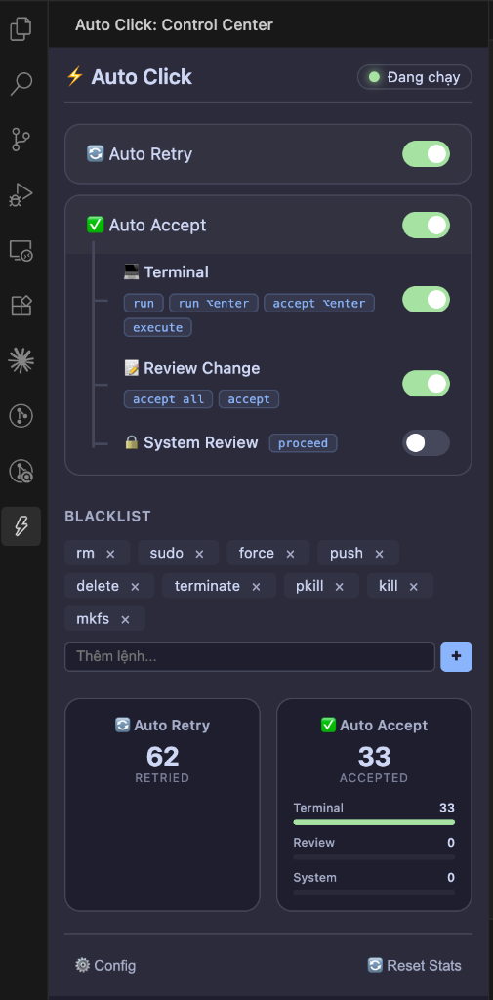

# 🤖 Antigravity Auto Retry-Click (Retry & Accept)

[Tiếng Việt](README.vi.md)

Automation tool suite for click actions in Antigravity IDE: Auto-Retry on errors and Auto-Accept agent proposals.

Starting from the latest version, the system has migrated to an **Extension-First** model, allowing you to orchestrate all activities directly inside the IDE via an intuitive **Control Center**.

<p align="center">
  
</p>

---

## 🛠️ Quick Start & Installation

### Step 1: Configure IDE Debug Mode (One-time setup)
To allow the tool to communicate with Antigravity IDE via Chrome DevTools Protocol (CDP), you **must** start the IDE with the debugging port enabled.
Run the following command in your macOS Terminal to create the `antigravity` alias:
```bash
echo 'alias antigravity="open -a \"Antigravity IDE\" --args --remote-debugging-port=31905"' >> ~/.zshrc && source ~/.zshrc
```
> [!IMPORTANT]
> Always start the IDE using the `antigravity` command. If forgotten, completely close the IDE and reopen it using this alias to activate the correct debug port.

### Step 2: Install the Extension
The tool is conveniently packaged as a `.vsix` file:
1. Open Antigravity IDE.
2. Drag and drop the `antigravity-auto-click-1.0.0.vsix` file into the IDE to install it.
3. If you used an older version, the system will automatically migrate your config without further action.

### Step 3: Use the Control Center Interface
- **Status Bar (Bottom Right)**: Click to toggle the **Control Center**. Real-time status display:
  - `Auto Click R / A (t|r|s)`:
    - `R`: Auto-Retry is Enabled.
    - `A`: Auto-Accept is Enabled.
    - `t|r|s`: Active categories (`terminal`, `reviewChange`, `systemReview`).
  - `STOPPED`: Daemon is inactive.
- **Control Center Dashboard**:
  - **Toggles**: Quick toggle for Auto Retry and Auto Accept (supporting 3 levels: Terminal, Review Change, System Review).
  - **Statistics**: Visual charts showing click statistics by action type.
  - **Blacklist Management**: Add/remove blocked commands easily using the tag interface.
  - **System Diagnostics**: Inspect the CDP port, configuration status, and view system logs for troubleshooting.

---

## ⚙️ Auto-Accept Categories Explanation

The system classifies auto-accept requests into 3 main groups to ensure maximum safety:
1. **terminal**: Auto-approve terminal command run requests.
   - *Note*: Commands are cross-checked with the `blacklist` before being clicked automatically to prevent running dangerous commands.
2. **reviewChange**: Auto-approve code changes (e.g., clicking `Proceed`, `Accept All` buttons).
3. **systemReview**: System-level confirmations or agent side-panel dialogs (higher safety requirements, synchronized with a master toggle).

---

## 📂 Data & Configuration Locations

Both the Extension and the CLI share the same data directory to ensure synchronization. The system automatically detects and uses the path corresponding to your installed IDE version (preferring Antigravity IDE):
- **Path on macOS**:
  - `~/Library/Application Support/Antigravity IDE/Auto Click` (default for new IDE)
  - `~/Library/Application Support/Antigravity/Auto Click` (legacy default)
- **Path on Windows**:
  - `%APPDATA%\Antigravity IDE\Auto Click` (default for new IDE)
  - `%APPDATA%\Antigravity\Auto Click` (legacy default)

### Key Files:
- `config.json`: System-wide configuration.
- `logs/activity-log.json`: Click statistics (can be disabled via `logging.activityLog` in config).
- `logs/daemon.log`: Background daemon log (can be disabled via `logging.enabled` to save disk space).

### Advanced Timing & Rate Limit Configurations
In `config.json`, you can fine-tune advanced parameters:
1. **`autoRetry.timing`**:
   - `pollInterval` (default `3000` ms): Polling frequency for scanning the IDE DOM for error dialogs.
   - `clickDelay` (default `800` ms): Click delay (simulates human interaction).
   - `minClickInterval` (default `5000` ms): Minimum interval between consecutive clicks (prevents double-clicks).
2. **`autoRetry.rateLimit`**:
   - `maxRetriesPerMinute` (default `15` clicks): Maximum clicks in a minute to prevent infinite loops during recurring errors.
   - `cooldownMs` (default `60000` ms): Cool down duration after reaching the rate-limit.

---

## ❓ Troubleshooting & CLI Diagnostics

If the system encounters an issue, you can quickly check:

| Issue | Resolution |
| :--- | :--- |
| **Extension reports "Config Invalid"** | Use the **System Diagnostics** menu to view details, then click **Open Raw Config** to edit. |
| **Daemon fails to start** | Check the **Antigravity Auto-Click** Output Channel in the IDE. Ensure no hung `node src/core/auto-retry.js` processes exist (use `pgrep -f auto-retry`). |
| **New buttons not detected** | Use CLI > Developer Tools > **Dump DOM Snapshot** and send the captured file to the development team. |
| **CDP fails to connect** | Ensure you completely closed the IDE before reopening it with the debug command `antigravity`. |

### Secondary Interface: CLI Menu
Designed for advanced administration or critical troubleshooting. Run:
```bash
./scripts/menu.sh
```
**CLI Features:**
- **Install LaunchAgent**: Enables the daemon to start automatically with macOS.
- **Developer Tools**: Analyze DOM live or dump DOM Snapshots for diagnostic analysis.
- **Reset statistics**: Clear click stats and optionally clear `daemon.log` to free disk space.

---

## 💻 Technical & Development

### 1. Architecture & Technology Stack
- **Core Engine**: Node.js daemon connecting to the Electron renderer via Chrome DevTools Protocol (CDP) over WebSockets.
- **Extension API**: VS Code extension acting as the control panel, using `WebviewViewProvider` for the UI.
- **DOM Automation Payload**: Vanilla JS injected directly into the IDE DOM to detect and interact with dialogs.
- **Passive Polling & Scoping**: Periodically scans the DOM, scoped within dialog containers (e.g., `.monaco-dialog-box`, `.notification-toast`) to minimize CPU overhead.

### 2. Project Structure
```text
antigravity-auto-click/
├── src/                   # Main source code
│   ├── extension/         # Extension controller logic (VS Code)
│   │   └── media/         # Webview UI Assets (CSS, JS)
│   ├── core/              # CDP Connection Daemon & Main Engine
│   └── payload/           # JS Injected into IDE (Detection Logic)
├── scripts/               # CLI & Utility Scripts
├── package.json           # Project Configuration & Build scripts
└── .vscodeignore          # File exclude configurations for VSIX packaging
```

### 3. Packaging (VSIX)
If you edit the source code and want to package the extension:
1. Install dependencies: `npm install`
2. Package Extension: `npm run package`
   - Generates the `.vsix` file in the root directory.

### 4. TDD & Regression Testing
Before releasing or modifying DOM detection logic, you must run the regression test suite:
- Run the full suite on DOM samples: `npm run test` (or run via CLI).
- Run extension stability tests: `npm run test:extension`.
- Detailed documentation on click mechanics and button detection is available in [button-identification.md](button-identification.md).
