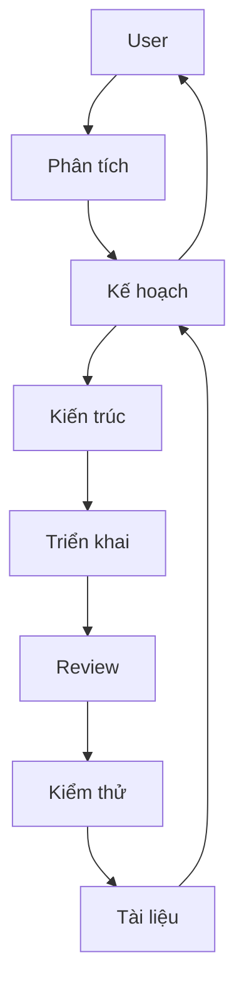

# Antigravity Auto-Click (Retry & Accept)

Bộ công cụ tự động hóa thao tác click cho Antigravity IDE: Tự động thử lại khi lỗi và Tự động chấp nhận đề xuất từ Agent.

## 1. Bài Toán & Giải Pháp

### 🧪 Testing
Verify your setup via the **Testing Lab** (Option 2 in CLI menu):
- **Auto-Retry (Live)**: Simulates a High Traffic dialog.
- **Auto-Accept (Live)**: Simulates an Agent "Run" or "Execute" dialog.
- **Regression (Offline)**: Verify logic against captured samples.

| Đặc điểm | Chi tiết |
| :--- | :--- |
| **Vấn đề** | Lỗi "High Traffic" yêu cầu click thủ công hoặc các đề xuất Agent cần Accept liên tục. |
| **Công nghệ** | Chrome DevTools Protocol (CDP) kết nối qua cổng debug `9222`. |
| **Cơ chế** | Inject JavaScript (MutationObserver) để phát hiện và click nút. |
| **Tính năng** | **Auto-Retry**: Click "Retry" khi gặp lỗi High Traffic.<br>**Auto-Accept**: Tự động click "Run", "Accept", v.v. (Hỗ trợ phân loại: Terminal, Review, System). |
| **Bảo vệ** | Có cơ chế **Blacklist** chặn tự động chạy các lệnh Terminal nguy hiểm. |
| **Ưu điểm** | Chính xác cao, linh hoạt (tắt/mở riêng biệt), an toàn với cơ chế blacklist & rate-limit. |
| **Vị trí UI** | Ưu tiên khu vực bên phải (Agent Side Panel) và các nút nằm trong phần footer. |

### 🛠️ Giải pháp Kỹ thuật

- **Scoping (Phạm vi):** Thu hẹp phạm vi nhận diện tại các container Dialog đặc hiệu (Side Panel, Monaco Dialog).
- **Phân cấp Nút:** Tự động ưu tiên các nút bấm nằm trong phần `footer` của container để đảm bảo tính chính xác.
- **Phát hiện Biến động:** Kết hợp `MutationObserver` (phản ứng tức thì) và `Polling` (3s) để đảm bảo độ tin cậy.
- **Nhận diện Thông minh:** Sử dụng Regex đa lớp để phân biệt giữa lỗi High Traffic và các yêu cầu thực thi của Agent.

## 2. Cấu Trúc Dự Án

```text
antigravity-auto-click/
├── .agents/               # Trí tuệ nhân tạo (AI Agent configurations)
├── logs/                  # Nhật ký vận hành hệ thống
├── samples/               # Dữ liệu mẫu (HTML DOM dumps) để kiểm thử
├── scratch/               # File nháp và thử nghiệm tạm thời
├── scripts/               # Bộ công cụ điều khiển & Script tiện ích
│   ├── core/              # Vận hành hệ thống (Start, Stop, Restart, Status)
│   ├── tests/             # Kiểm thử (Live triggers & Regression)
│   ├── tools/             # Công cụ phát triển (DOM Dump, Analyzers)
│   ├── menu.sh            # Giao diện điều khiển chính (CLI Menu)
│   └── install.sh         # Cài đặt tự động khởi động (LaunchAgent)
├── src/                   # Mã nguồn chính
│   ├── core/              # Daemon kết nối CDP & Điều phối injection
│   ├── payload/           # JavaScript sẽ được inject vào IDE
│   └── extension/         # Giao diện tích hợp vào VS Code
├── config.json            # Cấu hình tính năng & Danh sách chặn (Blacklist)
├── config.schema.json     # Schema định nghĩa cấu hình hợp lệ
└── README.md              # Tài liệu hướng dẫn này
```

### Chi Tiết Thành Phần:
- **`scripts/menu.sh`**: Entry point chính. Luôn bắt đầu từ đây để quản lý hệ thống.
- **`src/core/auto-retry.js`**: "Trái tim" của hệ thống, chạy ngầm để theo dõi và điều khiển IDE.
- **`src/payload/injection-payload.js`**: Chứa logic nhận diện Dialog (Regex, Container Scoping) và xử lý click.
- **`config.json`**: Cho phép bạn tùy chỉnh các lệnh Terminal nguy hiểm cần chặn hoặc bật/tắt các loại Auto-Accept.
- **`logs/activity-log.json`**: Lưu trữ lịch sử click để hiển thị thống kê trên Menu.

## 3. Hướng Dẫn Nhanh

**Bước 1: Bật chế độ Debug cho IDE (Bắt buộc)**
Dán lệnh sau vào Terminal để tạo alias khởi động nhanh:
```bash
echo 'alias antigravity="open -a Antigravity --args --remote-debugging-port=9222"' >> ~/.zshrc && source ~/.zshrc
```
Từ giờ, luôn mở IDE bằng cách gõ lệnh `antigravity` trong Terminal.

**Bước 2: Sử dụng & Vận hành**
- **Chi tiết tính năng:** Xem [tutorial.md](tutorial.md) để biết cách dùng qua CLI hoặc Extension.
- **Auto-Retry**: Tự động click thử lại khi gặp lỗi "High Traffic".
- **Auto-Accept**: Tự động chấp nhận các đề xuất an toàn từ Agent. Hỗ trợ bật/tắt riêng biệt cho lệnh Terminal, Review code và Xác nhận hệ thống.

**Dành cho Developer:**
- Cài đặt: `npm install`
- Chạy dev: `npm start`
- Xem Log: `tail -f daemon.log`

## 4. Hệ Thống AI Agents



- **BA:** Làm rõ yêu cầu.
- **Orchestrator:** Điều phối dự án.
- **Tech Leader:** Duyệt kiến trúc & Review code (BẮT BUỘC).
- **Developer:** Viết mã nguồn.
- **Tester:** Kiểm thử & Xác nhận.
- **Docs-Agent:** Bảo trì tài liệu.

## 5. Skills (Lệnh AI)
- **/status**: Kiểm tra trạng thái & log.
- **/test**: Giả lập lỗi để xác nhận hoạt động.
- **/deploy**: Khởi chạy hệ thống.
- **/review**: Kiểm tra mã nguồn & kiến trúc.
