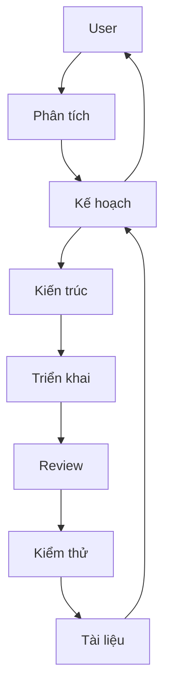

# Antigravity Auto-Click (Retry & Accept)

Bộ công cụ tự động hóa thao tác click cho Antigravity IDE: Tự động thử lại khi lỗi và Tự động chấp nhận đề xuất từ Agent.

## 1. Bài Toán & Giải Pháp

### 🧪 Testing
Verify your setup via the **Testing Lab** (Option 2 in CLI menu):
- **Auto-Retry (Live)**: Simulates a High Traffic dialog.
- **Auto-Accept (Live)**: Simulates an Agent "Run" or "Execute" dialog.
- **Regression (Offline)**: Verify logic against captured samples.

| Đặc điểm | Chi tiết |
| :--- | :--- |
| **Vấn đề** | Lỗi "High Traffic" yêu cầu click thủ công hoặc các đề xuất Agent cần Accept liên tục. |
| **Công nghệ** | Chrome DevTools Protocol (CDP) kết nối qua cổng debug `9222`. |
| **Cơ chế** | Inject JavaScript (MutationObserver) để phát hiện và click nút. |
| **Tính năng** | **Auto-Retry**: Click "Retry" khi gặp lỗi High Traffic.<br>**Auto-Accept**: Click "Accept", "Run", "Execute", v.v. |
| **Bảo vệ** | Có cơ chế **Blacklist** chặn tự động chạy các lệnh Terminal nguy hiểm. |
| **Ưu điểm** | Chính xác 100%, linh hoạt (tắt/mở riêng biệt), an toàn tuyệt đối. |

## 2. Cấu Trúc Dự Án
- `.agents/`: Cấu hình, luật và kỹ năng của AI Agents.
- `scripts/`: Bộ script quản lý (menu, install, test).
- `src/`: Mã nguồn chính (daemon, payload, extension).
- `config.json`: Cấu hình danh sách Blacklist và các tính năng.
- `tutorial.md`: Hướng dẫn sử dụng chi tiết.

## 3. Hướng Dẫn Nhanh

**Bước 1: Bật chế độ Debug cho IDE (Bắt buộc)**
Dán lệnh sau vào Terminal để tạo alias khởi động nhanh:
```bash
echo 'alias antigravity="open -a Antigravity --args --remote-debugging-port=9222"' >> ~/.zshrc && source ~/.zshrc
```
Từ giờ, luôn mở IDE bằng cách gõ lệnh `antigravity` trong Terminal.

**Bước 2: Sử dụng & Vận hành**
- **Chi tiết tính năng:** Xem [tutorial.md](tutorial.md) để biết cách dùng qua CLI hoặc Extension.
- **Auto-Retry**: Tự động click thử lại khi gặp lỗi "High Traffic".
- **Auto-Accept**: Tự động chấp nhận các đề xuất an toàn từ Agent.

**Dành cho Developer:**
- Cài đặt: `npm install`
- Chạy dev: `npm start`
- Xem Log: `tail -f daemon.log`

## 4. Hệ Thống AI Agents



- **BA:** Làm rõ yêu cầu.
- **Orchestrator:** Điều phối dự án.
- **Tech Leader:** Duyệt kiến trúc & Review code (Bắt buộc).
- **Developer:** Viết mã nguồn.
- **Tester:** Kiểm thử & Xác nhận.
- **Docs-Agent:** Bảo trì tài liệu.

## 5. Skills (Lệnh AI)
- **/status**: Kiểm tra trạng thái & log.
- **/test**: Giả lập lỗi để xác nhận hoạt động.
- **/deploy**: Khởi chạy hệ thống.
- **/review**: Kiểm tra mã nguồn & kiến trúc.
