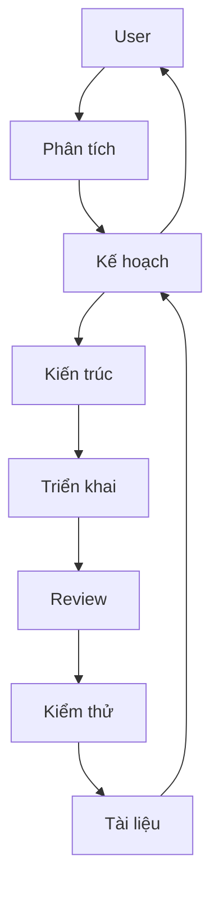

# Antigravity Auto-Click (Retry & Accept)

Bộ công cụ tự động hóa thao tác click cho Antigravity IDE: Tự động thử lại khi lỗi và Tự động chấp nhận đề xuất từ Agent.

## 1. Bài Toán & Giải Pháp

### 🧪 Testing
Verify your setup via **Test DOM samples** (CLI > Option 2 > Option 3):
- **Test DOM samples (Regression)**: Verify logic against captured Full-DOM snapshots using JSDOM.

| Đặc điểm | Chi tiết |
| :--- | :--- |
| **Vấn đề** | Lỗi "High Traffic" yêu cầu click thủ công hoặc các đề xuất Agent cần Accept liên tục. |
| **Công nghệ** | Chrome DevTools Protocol (CDP). Daemon tự dò `--remote-debugging-port` từ tiến trình Antigravity đang chạy. |
| **Cơ chế** | Inject JavaScript dùng polling theo chu kỳ để phát hiện và click nút. |
| **Tính năng** | **Auto-Retry**: Click "Retry" khi gặp lỗi High Traffic.<br>**Auto-Accept**: Nhận diện các nút "Run", "Accept", "Proceed"... theo category `terminal` / `review` / `system`. |
| **Bảo vệ** | Có cơ chế **Blacklist** chặn tự động chạy các lệnh Terminal nguy hiểm. |
| **Ưu điểm** | Chính xác cao, linh hoạt (tắt/mở riêng biệt), an toàn với blacklist, visibility checks và rate-limit. |
| **Vị trí UI** | Ưu tiên khu vực bên phải (Agent Side Panel) và các nút nằm trong phần footer. |

### 🛠️ Giải pháp Kỹ thuật

- **Scoping (Phạm vi):** Quét trực tiếp và toàn diện các container đặc hiệu như `.antigravity-agent-side-panel` (chính) và `.monaco-dialog-box` (phục vụ giả lập/testing).
- **Phân cấp Nút:** Tự động ưu tiên các nút bấm nằm trong phần `footer` của container để đảm bảo tính chính xác.
- **Phát hiện Biến động:** Dùng polling thụ động theo chu kỳ để giảm rủi ro race condition khi DOM thay đổi nhanh.
- **Nhận diện Thông minh:** Loại bỏ cơ chế lọc văn bản cấp container (Gate Logic) để tránh sai sót; sử dụng `TreeWalker` quét sâu Shadow DOM để tìm nút theo Regex pattern.
- **An toàn cho Auto-Accept:** Có phân loại `terminal` / `review` / `system`, blacklist lệnh nguy hiểm và cờ `autoAccept.performClick` để bật click thực tế khi cần.

## 2. Cấu Trúc Dự Án

```text
antigravity-auto-click/
├── .agents/               # Trí tuệ nhân tạo (AI Agent configurations)
├── logs/                  # Nhật ký vận hành hệ thống (tạo khi chạy)
├── samples/               # Dữ liệu mẫu (HTML DOM dumps) để kiểm thử
├── scripts/               # Bộ công cụ điều khiển & Script tiện ích
│   ├── core/              # Vận hành hệ thống (Start, Stop, Restart, Status)
│   ├── tests/             # Kiểm thử snapshot / regression
│   ├── tools/             # Công cụ phát triển (DOM Dump, Analyzers)
│   ├── menu.sh            # Giao diện điều khiển chính (CLI Menu)
│   └── install.sh         # Cài đặt tự động khởi động (LaunchAgent)
├── src/                   # Mã nguồn chính
│   ├── core/              # Daemon kết nối CDP & Điều phối injection
│   ├── payload/           # JavaScript sẽ được inject vào IDE
│   └── extension/         # Giao diện tích hợp vào VS Code
├── config.json            # Cấu hình tính năng & Danh sách chặn (Blacklist)
├── config.schema.json     # Schema định nghĩa cấu hình hợp lệ
└── README.md              # Tài liệu hướng dẫn này
```

### Chi Tiết Thành Phần:
- **`scripts/menu.sh`**: Entry point chính. Luôn bắt đầu từ đây để quản lý hệ thống.
- **`src/core/auto-retry.js`**: "Trái tim" của hệ thống, chạy ngầm để theo dõi và điều khiển IDE.
- **`src/payload/injection-payload.js`**: Chứa logic nhận diện Dialog (Regex, Container Scoping) và xử lý click.
- **`config.json`**: Cho phép bật/tắt Auto-Retry, Auto-Accept, cấu hình selector/pattern/rate-limit/timing của Retry và category/blacklist/perform-click của Accept.
- **`logs/activity-log.json`**: Lưu trữ lịch sử click để hiển thị thống kê trên Menu.

## 3. Hướng Dẫn Nhanh

**Bước 1: Bật chế độ Debug cho IDE (Bắt buộc)**
Dán lệnh sau vào Terminal để tạo alias khởi động nhanh:
```bash
echo 'alias antigravity="open -a Antigravity --args --remote-debugging-port=31905"' >> ~/.zshrc && source ~/.zshrc
```
Từ giờ, luôn mở IDE bằng cách gõ lệnh `antigravity` trong Terminal. `31905` chỉ là ví dụ; daemon sẽ tự dò port CDP thực tế từ tiến trình Antigravity.

**Bước 2: Sử dụng & Vận hành**
- **Chi tiết tính năng:** Xem [tutorial.md](tutorial.md) để biết cách dùng qua CLI hoặc Extension.
- **Auto-Retry**: Tự động click thử lại khi gặp lỗi "High Traffic".
- **Auto-Accept**: Nhận diện các đề xuất từ Agent. Click thực tế chỉ xảy ra khi `autoAccept.performClick=true`. Hỗ trợ bật/tắt riêng cho `terminal`, `review`, `system`.

**Dành cho Developer:**
- Cài đặt: `npm install`
- Chạy dev: `npm start`
- Xem Log LaunchAgent: `tail -f logs/daemon.log`

## 4. Kiểm thử & Phát triển (Testing Lab & Developer Tools)

Hệ thống cung cấp bộ công cụ mạnh mẽ để đảm bảo tính ổn định thông qua phân tích snapshot.

### 🧪 Test DOM samples (CLI > Developer Tools > Option 3)
Dùng để kiểm tra độ tin cậy của logic nhận diện dựa trên dữ liệu thực tế.
- **Test DOM samples (Regression)**: `node scripts/tests/regression.js` - Chạy logic nhận diện trên các mẫu **Full-DOM Snapshot** (SAMPLES) đã lưu sẵn. Hệ thống sẽ giả lập môi trường và xác nhận xem nút bấm có được click hay không.

### 🛠️ Developer Tools (CLI > Option 2)
- **Dump DOM Snapshot**: `node scripts/tools/dump-dom.js` - Chụp lại toàn bộ cấu trúc HTML của IDE và lưu vào thư mục `samples/`. Đây là bước duy nhất để tạo một ca kiểm thử mới (Test Case).
- **Phân tích DOM trực tiếp (Live Analysis)**: `node scripts/tools/analyze-live.js` - Phân tích thời gian thực trạng thái DOM và lý do daemon sẽ click hoặc không click.
- **Thống kê lý do bỏ qua (Skip Reasons)**: `node scripts/tools/list-skip-reasons.js` - Hiển thị bảng tổng hợp các lý do hệ thống đã bỏ qua không click (Rate limit, Visibility, UI Filters...).
- **Thống kê Accept theo category**: `node scripts/tools/list-accept-stats.js` - Tổng hợp số lần Auto-Accept click thực tế theo từng nhóm `terminal` / `review` / `system`.

## 5. Hệ Thống AI Agents



- **BA:** Làm rõ yêu cầu.
- **Orchestrator:** Điều phối dự án.
- **Tech Leader:** Duyệt kiến trúc & Review code (BẮT BUỘC).
- **Developer:** Viết mã nguồn.
- **Tester:** Kiểm thử & Xác nhận.
- **Docs-Agent:** Bảo trì tài liệu.

## 6. Skills (Lệnh AI)
- **/status**: Kiểm tra trạng thái & log.
- **/test**: Giả lập lỗi để xác nhận hoạt động.
- **/deploy**: Khởi chạy hệ thống.
- **/review**: Kiểm tra mã nguồn & kiến trúc.
