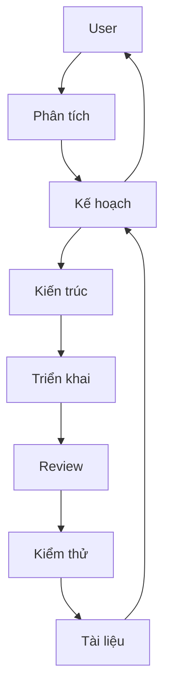

# Antigravity Auto-Retry

Tự động click "Retry" khi gặp lỗi "High Traffic" trong Antigravity IDE.

## 1. Bài Toán & Giải Pháp

| Đặc điểm | Chi tiết |
| :--- | :--- |
| **Vấn đề** | Lỗi "High Traffic" / "Server Busy" yêu cầu click thủ công liên tục. |
| **Công nghệ** | Chrome DevTools Protocol (CDP) kết nối qua cổng `31905`. |
| **Cơ chế** | Inject JavaScript (MutationObserver) để phát hiện và click nút chính xác. |
| **Ưu điểm** | Chính xác 100%, không tốn tài nguyên, an toàn (Rate Limit). |

## 2. Cấu Trúc Dự Án
- `.agents/`: Cấu hình, luật và kỹ năng của AI Agents.
- `scripts/`: Bộ script quản lý (menu, install, test).
- `src/`: Mã nguồn chính (daemon, payload, extension).
- `tutorial.md`: Hướng dẫn sử dụng chi tiết.

## 3. Hướng Dẫn Nhanh

**Bước 1: Bật chế độ Debug cho IDE (Bắt buộc)**
Dán lệnh sau vào Terminal để tạo alias khởi động nhanh:
```bash
echo 'alias antigravity="open -a Antigravity --args --remote-debugging-port=9222"' >> ~/.zshrc && source ~/.zshrc
```
Từ giờ, luôn mở IDE bằng cách gõ lệnh `antigravity` trong Terminal.

**Bước 2: Sử dụng Auto-Retry**
- **Dành cho Người dùng:** Xem [tutorial.md](tutorial.md).
- **Dành cho Developer:**
  - Cài đặt: `npm install`
  - Chạy dev: `npm start`
  - Xem Log: `~/Library/Logs/AntigravityAutoRetry/`

## 4. Hệ Thống AI Agents



- **BA:** Làm rõ yêu cầu.
- **Orchestrator:** Điều phối dự án.
- **Tech Leader:** Duyệt kiến trúc & Review code (Bắt buộc).
- **Developer:** Viết mã nguồn.
- **Tester:** Kiểm thử & Xác nhận.
- **Docs-Agent:** Bảo trì tài liệu.

## 5. Skills (Lệnh AI)
- **/status**: Kiểm tra trạng thái & log.
- **/test**: Giả lập lỗi để xác nhận hoạt động.
- **/deploy**: Khởi chạy hệ thống.
- **/review**: Kiểm tra mã nguồn & kiến trúc.
