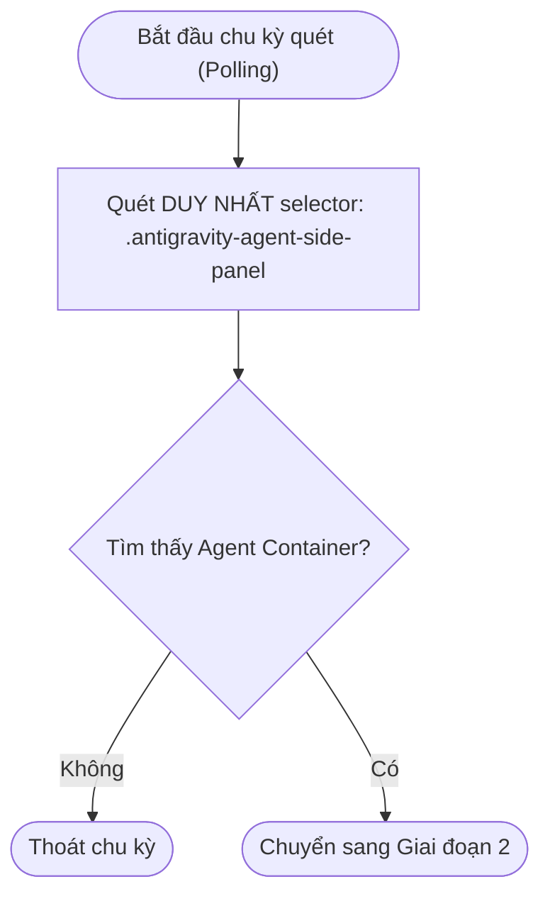
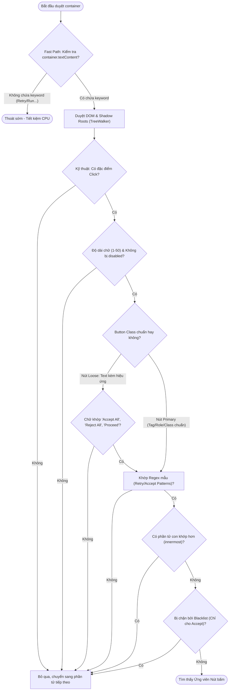
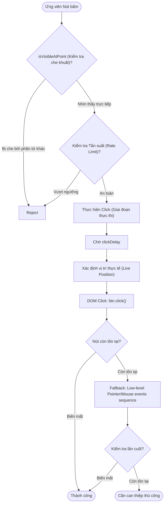

# Quy trình Phân tích Nút bấm (Target Button) - Chi tiết Kỹ thuật

Tài liệu này mô tả chi tiết thuật toán nhận diện và click tự động của Antigravity, được chia thành 3 giai đoạn chính để dễ theo dõi.

---

## Giai đoạn 1: Tìm kiếm & Phân loại Container

Giai đoạn này xác định **phạm vi duy nhất** mà hệ thống sẽ tìm kiếm nút bấm. Để đảm bảo an toàn tuyệt đối và hiệu năng cao nhất, hệ thống đã loại bỏ việc quét toàn bộ `document.body` hoặc các Dialog hệ thống.



---

## Giai đoạn 2: Quét & Phân tích Nút bấm (`findButtonsIn`)

Trong Container được chọn, hệ thống sử dụng cơ chế **Fast Path** để lọc nhanh trước khi dùng `TreeWalker` chuyên sâu.



---

## Giai đoạn 3: Thực thi & Xác thực Click

Khi đã có ứng viên, hệ thống thực hiện các "chốt chặn" vật lý cuối cùng. **Lưu ý**: Quy tắc "Phía bên phải" (Right Side Rule) đã được loại bỏ vì phạm vi quét đã được giới hạn an toàn trong Agent Window.



---

## Chi tiết Kỹ thuật bổ sung

### 1. Cách xác định "Có thể Click" (IsClickable)
Hệ thống sử dụng tổ hợp các điều kiện sau:
- **Thẻ HTML**: `<button>` hoặc `<input type="button">`.
- **Thuộc tính ARIA**: `role="button"`.
- **CSS Classes**: `.monaco-button`, `.action-label`, `.bg-ide-button-background`.
- **Cursor**: Bất kỳ phần tử nào có `cursor: pointer` được thiết lập trong CSS (được kiểm tra qua `getComputedStyle`).

### 2. Cách xác định Container (Đã tối ưu)
- **Phạm vi hẹp**: Chỉ quét duy nhất `.antigravity-agent-side-panel`. 
- **Loại bỏ Fallback**: Hệ thống không còn tự động quét `document.body` nếu không tìm thấy container. Điều này triệt tiêu hoàn toàn rủi ro click nhầm vào các thành phần hệ thống của IDE.
- **Loại bỏ Right Side Rule**: Trước đây, hệ thống yêu cầu nút phải nằm bên phải màn hình. Nay, do đã giới hạn vào Agent Window, mọi nút khớp pattern đều được coi là an toàn để click.

### 3. Cơ chế Fast Path (Mới)
Trước khi thực hiện duyệt DOM chuyên sâu (TreeWalker), hệ thống thực hiện một bước kiểm tra "quét thô" cực nhanh trên toàn bộ văn bản của container:

- **Trích xuất Keyword**: Hệ thống duyệt qua danh sách các mẫu Regex (Retry, Accept All...) và trích xuất phần văn bản thuần từ chúng (ví dụ: `/^Retry$/i` được trích xuất thành `"retry"`).
- **Đối sánh Chuỗi tổng**: Sử dụng `root.textContent.toLowerCase().includes(keyword)`. Nếu **không có bất kỳ** từ khóa nào xuất hiện trong chuỗi văn bản tổng của container, hệ thống sẽ dừng lại ngay lập tức.
- **Tại sao hiệu quả?**: Việc kiểm tra một chuỗi văn bản dài bằng lệnh `includes` bản chất là chạy code C++ tối ưu của trình duyệt, nhanh hơn hàng trăm lần so với việc dùng JavaScript để duyệt từng phần tử DOM và chạy Regex trên từng phần tử đó.

### 4. Kiểm tra khả năng hiển thị (Visibility)
Sử dụng hàm `document.elementFromPoint(x, y)` tại điểm trung tâm của nút. 
- Nếu kết quả trả về là chính nút đó hoặc một phần tử con của nó -> **Nhìn thấy**.
- Nếu kết quả trả về là một phần tử khác (ví dụ: một lớp phủ mờ) -> **Bị che khuất**.

### 5. Cơ chế Click Dự phòng (Fallback)
Thông thường, hệ thống sẽ dùng lệnh `element.click()` để kích hoạt nút bấm. Tuy nhiên, một số framework hiện đại (như React) hoặc các thành phần UI phức tạp của VS Code có cơ chế bảo mật hoặc quản lý trạng thái khắt khe — chúng yêu cầu phải thấy các tương tác vật lý thì mới thực hiện lệnh.

Khi lệnh `.click()` đơn thuần không làm nút biến mất, hệ thống sẽ kích hoạt **Fallback**, giả lập một **Low-level Pointer/Mouse events sequence** đầy đủ tại đúng tọa độ của nút:
1.  **pointerdown & mousedown**: Giả lập hành động nhấn chuột xuống (kích hoạt trạng thái `:active`, đổi màu nút).
2.  **pointerup & mouseup**: Giả lập hành động thả chuột ra.
3.  **click**: Sự kiện chốt hạ để thực hiện logic.

Việc gửi chuỗi sự kiện này giúp "đánh lừa" các bộ máy xử lý sự kiện phức tạp, đảm bảo tỉ lệ click thành công gần như 100% trên mọi loại giao diện.
### 6. Tại sao giới hạn độ dài chữ (1-50 ký tự)?
Hệ thống chỉ kiểm tra các nút có độ dài văn bản từ 1 đến 50 ký tự để đảm bảo:
- **Hiệu năng (Early Exit)**: Phép so sánh độ dài chuỗi cực nhanh, giúp bỏ qua ngay lập tức các khối văn bản lớn (đoạn chat, log file) mà không cần tốn tài nguyên chạy bộ máy Regex phức tạp.
- **Tránh khớp nhầm (False Positive)**: Ngăn việc các từ khóa như "Run" hay "Retry" bị nhận diện nhầm khi chúng nằm giữa một đoạn văn bản dài không phải là nút bấm.
- **Độ chính xác**: Các nút hành động thực tế trong IDE hầu hết đều ngắn gọn (thường dưới 20 ký tự). Ngưỡng 50 là con số an toàn để bao quát cả các nhãn dài nhất mà vẫn lọc được nhiễu.
### 7. Kiểm tra vùng an toàn (Safe Context Check)
Đây là bước lọc để đảm bảo hệ thống không click nhầm vào các thành phần điều hướng của IDE. Hệ thống sẽ **bỏ qua** các nút nếu chúng nằm trong:
- **Menu & List**: Menu chuột phải, danh sách gợi ý (Quick Input), hoặc bảng chọn (Listbox).
- **Điều hướng File**: Trình quản lý file (Explorer), thanh Tab, hoặc thanh Breadcrumbs.
- **Vùng soạn thảo**: Bên trong trình soạn thảo code (Editor) để tránh click vào các từ khóa trong code.
- **Thanh tiêu đề**: Các nút trên Title bar của IDE.

**Mục tiêu**: Đảm bảo tính chính xác và không gây gián đoạn cho các thao tác thủ công của người dùng trên giao diện IDE.

### 8. Phân biệt Button chuẩn và Nút Loose (Text kèm hiệu ứng)
Trong giao diện IDE, có rất nhiều thành phần khi di chuột vào sẽ xuất hiện biến thể `cursor: pointer` (hình bàn tay) nhưng không phải là một `Button` lệnh thực sự. Hệ thống phân loại như sau:

- **Button chuẩn (Primary Button)**: Sử dụng các thẻ chuẩn như `button`, `input` (type button), thuộc tính `role="button"` hoặc class `.monaco-button`. Hệ thống tin tưởng các thành phần này và cho phép click nếu văn bản khớp với mẫu.
- **Văn bản có thể click (Loose Clickable)**: Các phần tử được nhận diện là loose nếu thỏa **bất kỳ** điều kiện sau (hàm `hasLooseClickability`):
  - Có class `.button` hoặc `.btn`
  - Có class `.cursor-pointer`
  - Có inline style `cursor: pointer` (`el.style.cursor`)
  - Có computed style `cursor: pointer` (`getComputedStyle(el).cursor`)

  > **Tại sao `.button`/`.btn` (class) lại là Loose chứ không phải Primary?**
  > Vì đây là **class CSS thuần túy** — bất kỳ `<div>` hay `<span>` nào cũng có thể gắn class này để tạo kiểu dáng trông như button, nhưng không có ngữ nghĩa HTML thật. Ngược lại, Primary chỉ tin tưởng **thẻ `<button>` thật** hoặc ARIA role/class VS Code cụ thể.
  >
  > ```html
  > <button>Run</button>          <!-- Primary: tag HTML chuẩn -->
  > <div class="button">Run</div> <!-- Loose: chỉ là div mặc phong cách -->
  > <span class="btn">Run</span>  <!-- Loose: tương tự -->
  > ```

  Loại này rất dễ gây **click nhầm** (False Positive) vì nhiều thành phần UI dùng cursor pointer mà không phải button thật.

**Tại sao phải kiểm tra khắt khe?**
Để đảm bảo an toàn, nếu một phần tử chỉ là `Loose Clickable` (không phải `Button` chuẩn), hệ thống **bắt buộc** văn bản trên đó phải khớp đúng regex `/accept all|reject all|proceed/i`. Đây là 3 cụm từ duy nhất được chấp nhận — **không có thêm từ nào khác** (kể cả "Yes").

Việc này giúp loại bỏ trường hợp click vào một đoạn văn bản hay một icon điều hướng chỉ vì nó có hiệu ứng bàn tay và tình cờ chứa từ khóa (ví dụ: một dòng thông báo có chữ "run" bên trong nhưng không phải là một `Button` Run).

### 9. Ưu tiên phần tử con sâu nhất (Innermost Element Priority)
Hệ thống luôn cố gắng tìm ra phần tử nhỏ nhất và cụ thể nhất để thực hiện lệnh click.

- **Vấn đề**: Trong HTML, một `Button` thực sự thường được bao bọc bởi các thẻ cha (như `div` hay `span`). Do cơ chế cộng dồn văn bản, cả thẻ cha và thẻ con đều chứa cùng một nội dung (ví dụ: chữ "Retry").
- **Cơ chế**: Khi tìm thấy một ứng viên, hệ thống sẽ kiểm tra xem bên trong nó có phần tử con nào khác cũng khớp với điều kiện hay không. Nếu có, nó sẽ bỏ qua thẻ cha để chọn thẻ con sâu nhất.
- **Lý do**: Click vào phần tử sâu nhất đảm bảo hành động được thực hiện trực tiếp lên `Button`, kích hoạt đúng các hiệu ứng giao diện và tránh việc click nhầm vào các vùng đệm (padding) hoặc các phần tử bao quanh không liên quan.

### 10. Luồng kiểm tra Blacklist (Chặn hành động không mong muốn)
Hệ thống duy trì một danh sách các từ khóa bị cấm (Blacklist) để ngăn chặn các hành động tự động click sai ngữ cảnh hoặc gây lặp lại vô tận.

- **Đối tượng áp dụng**: Chủ yếu dành cho các hành động **Auto Accept** (như tự động bấm Run/Accept trong Terminal).
- **Cơ chế hoạt động**:
    1. Khi tìm thấy một nút "Accept", hệ thống trích xuất văn bản xung quanh (Command Text).
    2. Nếu Command Text chứa bất kỳ từ khóa nào trong `blacklist` (ví dụ: "rm -rf", "delete"), hành động sẽ bị chặn ngay lập tức.
- **Mục tiêu**: Đảm bảo an toàn dữ liệu và tránh việc hệ thống tự động thực hiện các lệnh nguy hiểm hoặc không được phép.
